# Organisation Scrum — Projet GMAO Optima

> **Méthodologie Agile Scrum** appliquée au développement d'une plateforme de maintenance prédictive pour CEVITAL.
> **Durée totale estimée : 16 semaines.**

---

## Vue d'ensemble — Backlog produit

| Sprint | Thème | Durée | Livrables clés |
|---|---|---|---|
| **Sprint 0** | Initialisation projet | 1 sem | Architecture, BDD initiale, maquettes, backlog |
| **Sprint 1** | Authentification & Gestion utilisateurs | 2 sem | JWT, RBAC, CRUD users/pôles/zones/équipes |
| **Sprint 2** | Gestion équipements & historique | 2 sem | Hiérarchie machines, import historique CSV |
| **Sprint 3** | Workflow maintenance (DI / OT / Interventions) | 3 sem | DI → OT → Intervention + notifications WebSocket |
| **Sprint 4** | Module Stock | 2 sem | Pièces, liaison composantes, réservations |
| **Sprint 5** | Prédiction ML (LSTM / GRU) | 3 sem | Pipeline RUL, comparaison pannes réelles vs prédites, OT prédictifs |
| **Sprint 6** | Dashboard & Analytics | 2 sem | KPIs live, alertes intelligentes, visualisations |
| **Sprint 7** *(buffer)* | Tests, déploiement, soutenance | 1 sem | Tests E2E, déploiement, rédaction finale |

---

## Acteurs (8 rôles)

| Rôle | Description |
|---|---|
| **ADMIN** | Administrateur système — accès global, configuration |
| **METHODISTE** | Méthodiste — pilote prédictif et planification (par pôle) |
| **CHEF_POLE** | Responsable opérationnel d'un pôle |
| **CHEF_EQUIPE** | Chef d'équipe terrain |
| **MECANICIEN** | Intervenant mécanique |
| **TECHNICIEN** | Intervenant technique |
| **HSE** | Hygiène, Sécurité, Environnement |
| **GESTIONNAIRE_STOCK** | Gestion des pièces de rechange |

---

# 🔵 SPRINT 0 — Initialisation projet (1 semaine)

## Objectifs
- Cadrer le projet et définir l'architecture
- Modéliser la base de données initiale
- Réaliser les maquettes (Figma / wireframes)
- Constituer le backlog produit complet
- Choix techno : **Next.js 16 · FastAPI · PostgreSQL · TensorFlow/Keras · Redux Toolkit**

## Livrables
- Schéma d'architecture en couches (Frontend / API REST / BDD / Service ML)
- Diagramme de déploiement
- Backlog priorisé (60+ user stories)
- Maquettes Figma de toutes les pages principales

---

# 🔵 SPRINT 1 — Authentification & Gestion des utilisateurs (2 semaines)

## Description
Mise en place de la sécurité (JWT), du contrôle d'accès basé sur les rôles (RBAC), de la gestion des utilisateurs et de la structure organisationnelle (pôles, zones, équipes, quarts de travail).

## User Stories
1. En tant qu'**utilisateur**, je veux me connecter avec mon identifiant et mot de passe pour accéder à l'application.
2. En tant qu'**utilisateur**, je veux pouvoir réinitialiser mon mot de passe.
3. En tant qu'**ADMIN**, je veux créer/modifier/supprimer des utilisateurs avec leurs rôles.
4. En tant qu'**ADMIN**, je veux gérer les pôles industriels (CRUD).
5. En tant qu'**ADMIN**, je veux gérer les zones rattachées aux pôles.
6. En tant qu'**ADMIN**, je veux gérer les équipes (rattachées à un pôle et à un quart).
7. En tant qu'**ADMIN**, je veux gérer les quarts de travail (Matin / Après-midi / Nuit).
8. En tant qu'**utilisateur**, je veux modifier mon profil et changer mon mot de passe.
9. En tant qu'**utilisateur**, je veux que ma session expire après 30 min d'inactivité.

## Diagramme de cas d'utilisation

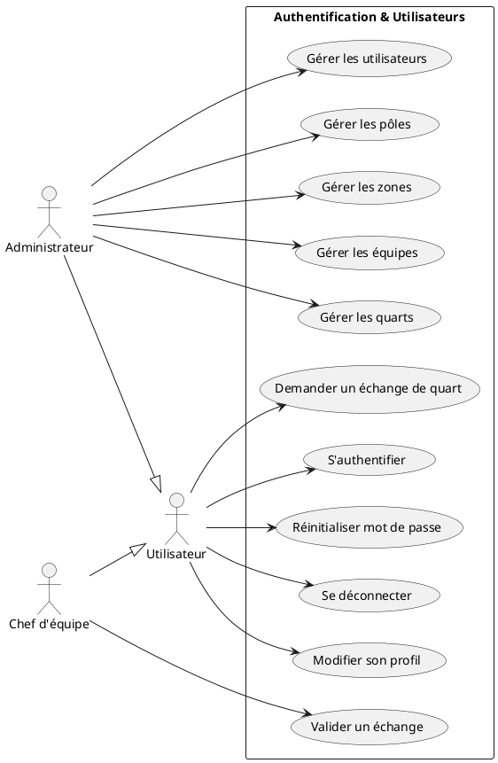

## Diagramme de classes

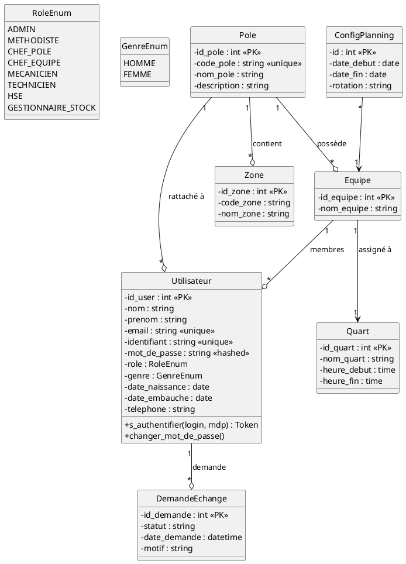

---

# 🔵 SPRINT 2 — Gestion des équipements & historique (2 semaines)

## Description
Modélisation de la hiérarchie des équipements (5 niveaux : système → ensemble → sous-ensemble → composant → pièce) et import du fichier historique des interventions correctives/préventives.

## User Stories
1. En tant qu'**ADMIN**, je veux créer un équipement avec son niveau hiérarchique et son parent.
2. En tant qu'**ADMIN**, je veux modifier/supprimer un équipement existant.
3. En tant qu'**utilisateur**, je veux visualiser la hiérarchie machine racine d'un composant.
4. En tant qu'**utilisateur**, je veux filtrer les équipements par pôle, zone ou niveau.
5. En tant qu'**utilisateur**, je veux rechercher un équipement par code SAP.
6. En tant qu'**ADMIN**, je veux importer un fichier CSV d'historique d'interventions.
7. En tant qu'**ADMIN**, je veux consulter l'historique d'un équipement (toutes ses pannes).

## Diagramme de cas d'utilisation

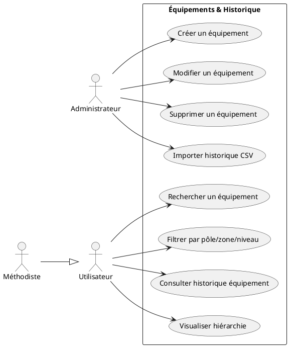

## Diagramme de classes

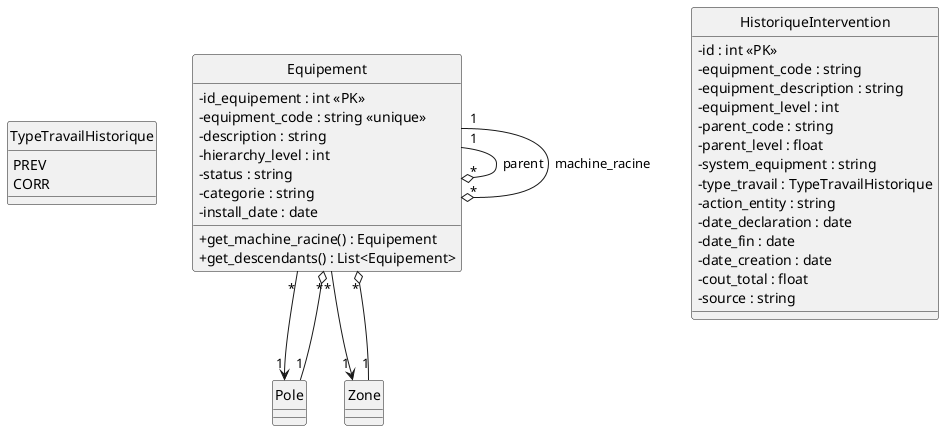

---

# 🔵 SPRINT 3 — Workflow Maintenance (3 semaines)

## Description
Implémentation du workflow complet de maintenance corrective et préventive : déclaration d'une demande d'intervention (DI), conversion en ordre de travail (OT), assignation à un mécanicien, exécution de l'intervention, et validation hiérarchique (Chef d'équipe + HSE). Notifications temps réel via WebSocket.

## User Stories
1. En tant qu'**utilisateur**, je veux créer une DI pour signaler une panne.
2. En tant que **METHODISTE**, je veux vérifier et valider/rejeter une DI.
3. En tant que **METHODISTE**, je veux générer un OT depuis une DI validée.
4. En tant que **METHODISTE**, je veux assigner un OT à un mécanicien.
5. En tant que **MECANICIEN**, je veux démarrer une intervention.
6. En tant que **MECANICIEN**, je veux clôturer une intervention avec un rapport.
7. En tant que **CHEF_EQUIPE**, je veux valider une intervention terminée.
8. En tant que **HSE**, je veux valider HSE une intervention.
9. En tant qu'**utilisateur**, je veux recevoir des notifications temps réel pour mes OT et DI.
10. En tant qu'**utilisateur**, je veux exporter un OT en PDF ou CSV.

## Diagramme de cas d'utilisation

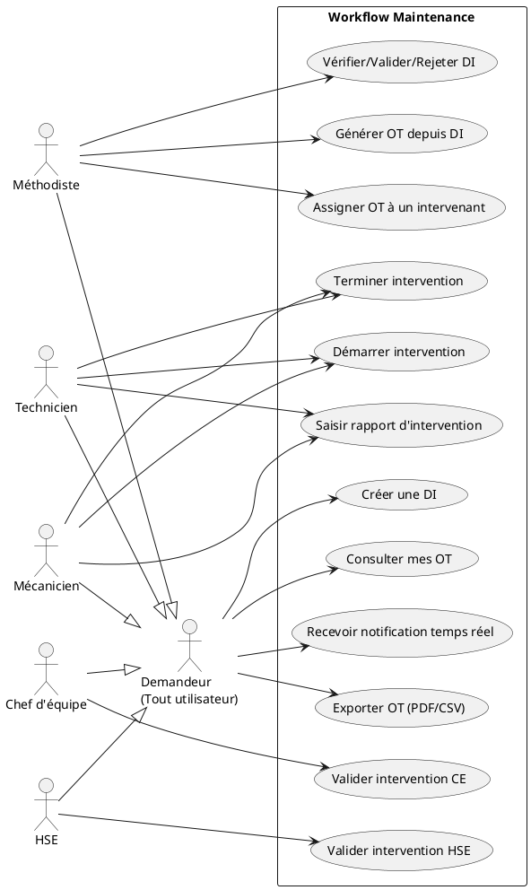

## Diagramme de classes

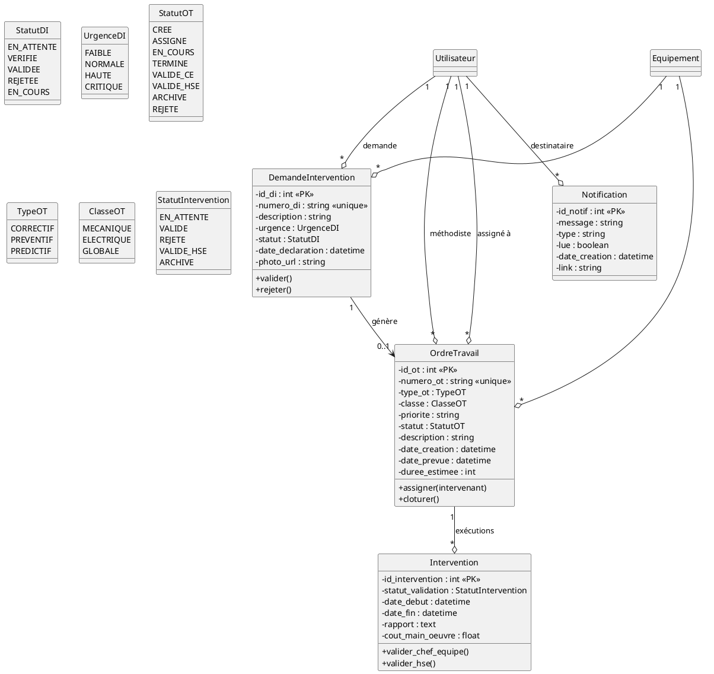

---

# 🔵 SPRINT 4 — Module Stock (2 semaines)

## Description
Gestion complète du stock de pièces de rechange : référencement des pièces, liaison aux équipements concernés (table de jonction `ComposanteStock`), workflow de réservation par les mécaniciens, validation et livraison par le gestionnaire de stock.

## User Stories
1. En tant que **GESTIONNAIRE_STOCK**, je veux créer une nouvelle pièce de rechange.
2. En tant que **GESTIONNAIRE_STOCK**, je veux lier une pièce aux équipements concernés.
3. En tant que **GESTIONNAIRE_STOCK**, je veux modifier la quantité et le seuil d'alerte.
4. En tant que **MECANICIEN**, je veux rechercher une pièce par code équipement.
5. En tant que **MECANICIEN**, je veux réserver une pièce pour un OT.
6. En tant que **GESTIONNAIRE_STOCK**, je veux valider une demande de réservation.
7. En tant que **GESTIONNAIRE_STOCK**, je veux livrer une pièce (décrément automatique du stock).
8. En tant qu'**utilisateur**, je veux voir les alertes de stock faible/épuisé.

## Diagramme de cas d'utilisation

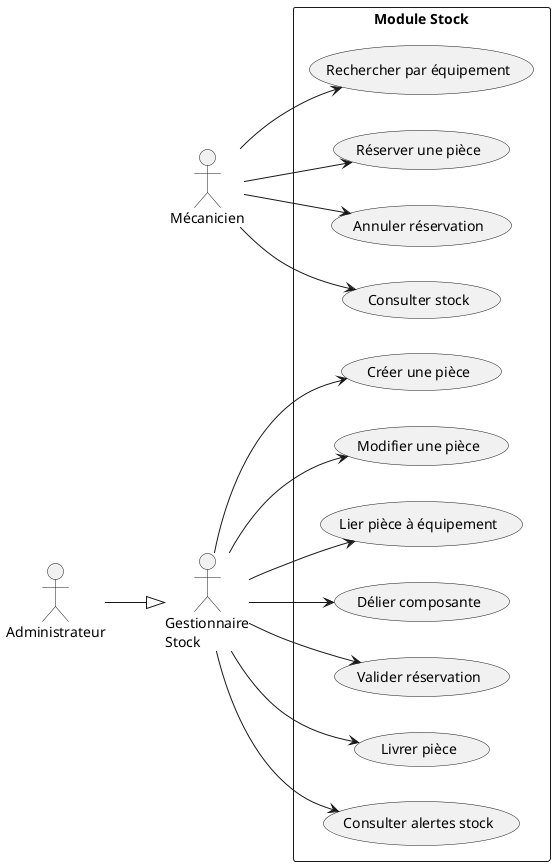

## Diagramme de classes

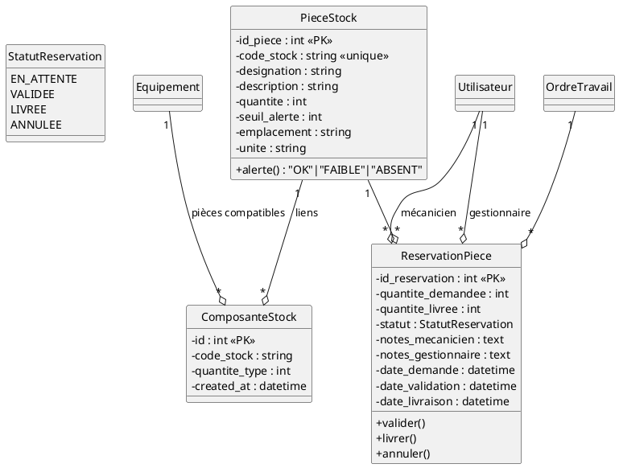

---

# 🔵 SPRINT 5 — Prédiction ML (LSTM / GRU) (3 semaines)

## Description
**Cœur du projet** — Mise en œuvre du système de maintenance prédictive basé sur des modèles deep learning (LSTM et GRU) entraînés sur l'historique des interventions correctives. Pipeline complet : ingestion des features (DSLF, DSLM, pannes/maintenances roulantes), inférence mensuelle avec ref_date glissant, et boucle d'apprentissage continu (export → réentraînement externe → réimport).

## User Stories
1. En tant qu'**ADMIN**, je veux uploader un modèle ML (.keras + 2 scalers).
2. En tant qu'**ADMIN**, je veux activer un modèle parmi ceux disponibles.
3. En tant qu'**ADMIN**, je veux comparer les performances des modèles (R², MAE, F1).
4. En tant que **METHODISTE**, je veux choisir le type de modèle (GRU/LSTM/Actif) avant un run.
5. En tant que **METHODISTE**, je veux lancer une prédiction RUL filtrée sur les composants test de mon pôle.
6. En tant que **METHODISTE**, je veux visualiser les résultats sous 3 vues : tableau, graphes (donut, histogramme, top critiques), comparaison machines/zones.
7. En tant que **METHODISTE**, je veux consulter la fiche détail d'un composant avec comparaison pannes réelles vs prédite.
8. En tant que **METHODISTE**, je veux générer un OT prédictif depuis une fiche composant.
9. En tant qu'**ADMIN**, je veux exporter les nouvelles données depuis le dernier export pour réentraînement externe.
10. En tant qu'**ADMIN**, je veux consulter l'historique complet des runs de prédiction.

## Diagramme de cas d'utilisation

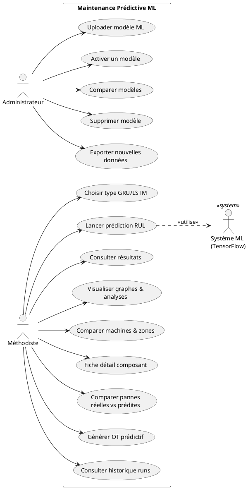

## Diagramme de classes

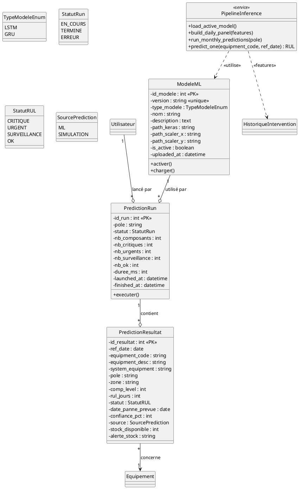

---

# 🔵 SPRINT 6 — Dashboard & Analytics (2 semaines)

## Description
Tableau de bord unifié intégrant toutes les données opérationnelles : KPIs live (OT/DI/Interventions), widget de prédictions ML (composants à risque immédiat + alertes stock), graphes interactifs et auto-refresh.

## User Stories
1. En tant qu'**utilisateur**, je veux consulter mon tableau de bord en temps réel.
2. En tant qu'**ADMIN**, je veux filtrer le dashboard par pôle.
3. En tant que **METHODISTE**, je veux voir uniquement les données de mon pôle.
4. En tant qu'**utilisateur**, je veux voir les 6 KPIs principaux en haut.
5. En tant qu'**utilisateur**, je veux voir les composants à risque immédiat (ML).
6. En tant qu'**utilisateur**, je veux voir les graphes OT/DI/Interventions par statut.
7. En tant qu'**utilisateur**, je veux voir le top zones et top pôles.
8. En tant qu'**utilisateur**, je veux voir les activités récentes (OT + DI).
9. En tant qu'**utilisateur**, je veux que le dashboard se rafraîchisse automatiquement.

## Diagramme de cas d'utilisation

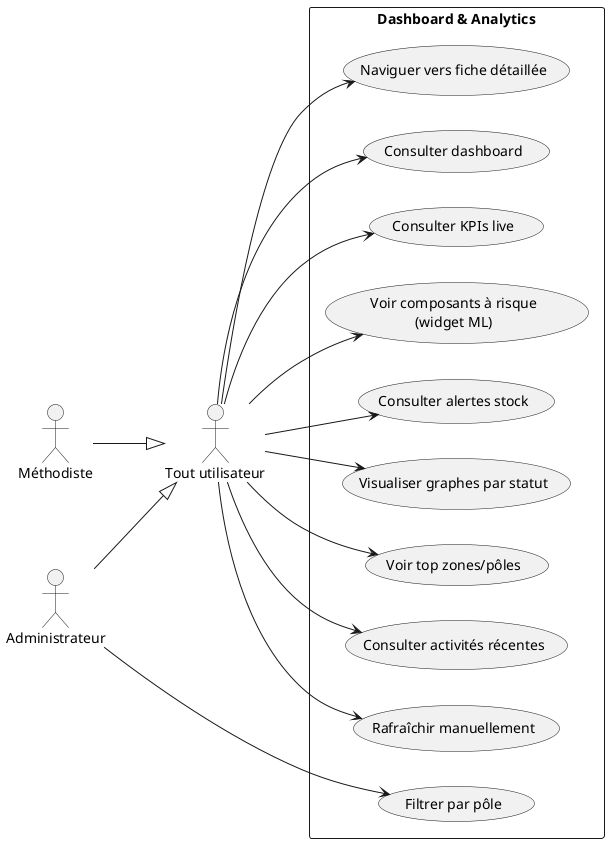

## Diagramme de classes

> Le sprint 6 **n'introduit pas de nouvelle entité métier** — il s'appuie sur des **vues agrégées** des modules précédents via des services dédiés.

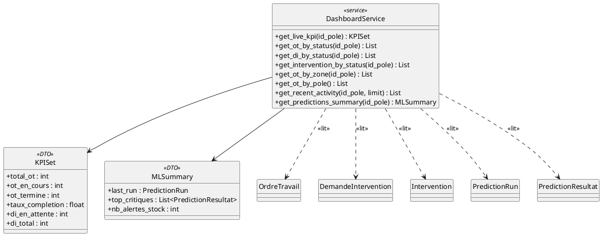

---

# 🔵 SPRINT 7 *(buffer)* — Tests, déploiement, rédaction (1 semaine)

## Objectifs
- **Tests E2E** : Playwright/Cypress sur les parcours critiques (login → DI → OT → prédiction → OT prédictif)
- **Tests unitaires** : services métier (`ml_inference`, `stock`, `predictions`)
- **Documentation** : OpenAPI/Swagger pour l'API REST + README pour le déploiement
- **Déploiement** : Docker Compose (frontend Next.js + backend FastAPI + PostgreSQL)
- **Rédaction finale du mémoire** : assemblage des chapitres + soutenance

---

# 📊 Diagramme de classes GLOBAL (référence)

> Vue unifiée à insérer en annexe du mémoire.

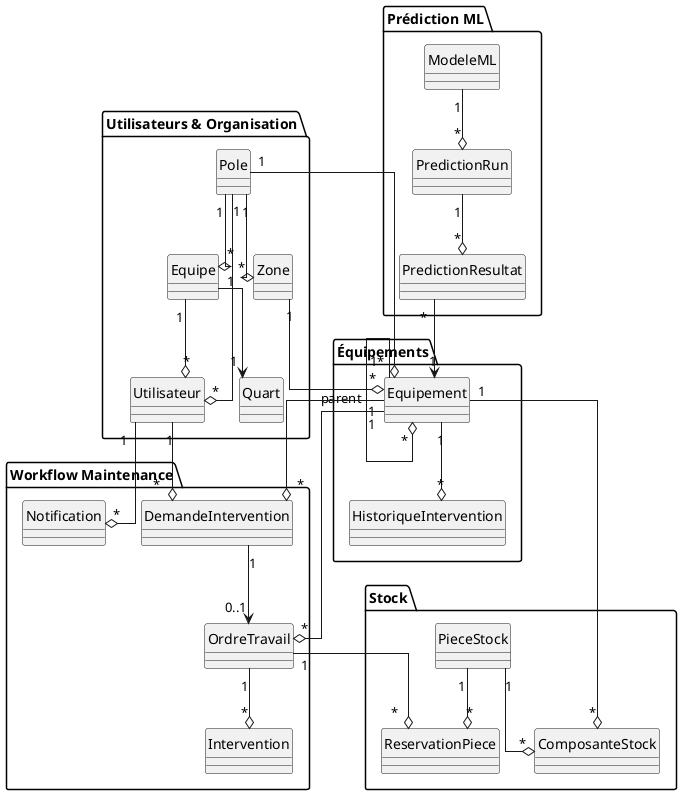

---

# 📋 Tableau récapitulatif sprints × livrables

| Sprint | Backend | Frontend | BDD | ML |
|---|---|---|---|---|
| 1 | JWT, RBAC, CRUD users | Login, Profil, Pages admin users/pôles | Tables auth | — |
| 2 | CRUD équipements, Import CSV | Page équipements + hiérarchie | Tables équipements, historique | — |
| 3 | Workflows DI/OT/Interventions + WS | Pages DI, OT, Interventions, notifications | Tables DI/OT/Intervention | — |
| 4 | CRUD pièces + réservations | Pages stock, ajout pièce, réservations | Tables pieces_stock | — |
| 5 | Pipeline ML + endpoints prédictions | Pages prédictions, fiche composant, admin modèles | Tables ModeleML, PredictionRun | **Inférence LSTM/GRU** |
| 6 | Endpoints dashboard live | Dashboard avec KPIs + widget ML | Vues SQL | — |
| 7 | Tests + Docker | Tests E2E | Migrations finales | Boucle réentraînement |

---

# 🎯 Conseils de rédaction pour le mémoire

1. **Pour chaque sprint** : 1 chapitre avec :
   - Objectifs & user stories
   - Diagrammes (UC + classes)
   - Architecture technique implémentée
   - Captures d'écran de l'interface
   - Difficultés rencontrées + solutions

2. **Avant sprints (chapitres 1-3)** : Contexte, état de l'art, méthodologie Scrum

3. **Après sprints (chapitres finaux)** : Évaluation du modèle ML (métriques R²=0.74, MAE=3.45j), résultats, perspectives

4. **Annexes** : Diagramme global, screenshots, code clés du pipeline ML
