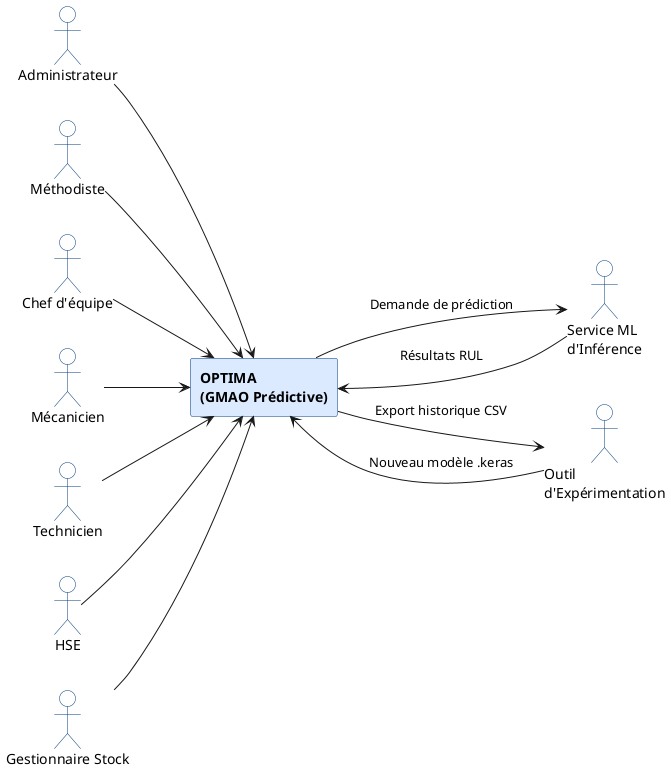

# Chapitre 3 — Analyse et spécification des besoins

## Introduction

Ce chapitre représente le pont entre la pensée et la réalisation de notre projet **Optima**, et ce, en posant les fondations de ce dernier.

Pour orienter cette mise en place, nous avons choisi d'adopter une méthodologie agile assez connue dite la méthode **Scrum**. Nous débuterons ainsi par présenter les concepts fondamentaux de cette dernière, qui nous ont permis de piloter efficacement la spécification des besoins.

Nous passerons par la suite à la présentation des langages et technologies utilisés.

Enfin nous présenterons les différents acteurs du système, les user stories, la planification des livrables ainsi que le backlog produit, afin de traduire de manière concrète les attentes fonctionnelles.

---

## 3.1 Présentation de la méthode Scrum

Dans ce qui suit, nous présenterons les concepts de base de la méthode Scrum, permettant d'éclairer le choix porté sur cette dernière.

### 3.1.1 Pourquoi Scrum ?

**Scrum** est un framework de gestion de projet agile utilisé pour développer des projets de manière itérative et incrémentale. Il met l'accent sur la collaboration, la flexibilité et l'amélioration continue, visant à réaliser des tâches à haute valeur ajoutée à chaque itération.

Le choix de Scrum pour notre projet **Optima** se justifie par plusieurs raisons :

- **Complexité fonctionnelle élevée** : le projet combine un système GMAO classique (workflow correctif) avec un module d'intelligence artificielle (prédiction de pannes). Cette complexité justifie une approche itérative permettant des ajustements progressifs.
- **Besoins évolutifs** : les exigences métier de CEVITAL ont évolué au fil du projet (ajout de l'outil d'expérimentation, raffinement du dashboard, etc.). Scrum nous a permis d'absorber ces changements sans casser la dynamique.
- **Livrables incrémentaux** : chaque sprint produit un incrément fonctionnel testable, ce qui facilite la validation continue par l'encadrant et la démonstration progressive.
- **Visibilité du progrès** : les cérémonies Scrum (Sprint Planning, Sprint Review) offrent une visibilité claire sur l'avancement du projet et permettent une communication structurée avec l'encadrement.

### 3.1.2 Rôles

Scrum définit 3 rôles essentiels : le Product Owner, le Scrum Master et l'équipe de développement.

- **Le Product Owner** : Considéré comme le pont entre les besoins métiers (clients, utilisateurs finaux) et l'équipe technique. Il est chargé de la traduction des exigences du business et de la gestion du backlog produit tout en veillant à ce que l'équipe travaille toujours sur ce qui a le plus de valeur.

- **Le Scrum Master** : Fait office de coach. Son rôle est de faciliter le processus Scrum, de débloquer les obstacles et d'assurer le bon déroulement de ce dernier au sein de l'équipe.

- **L'équipe de développement** : Bâtisseurs du projet et responsables de la livraison de fonctionnalités utilisables à chaque fin de sprint. Cette équipe est idéalement composée de 6 à 10 personnes, qui travaillent en collaboration afin d'assurer leurs responsabilités.

### 3.1.3 Artefacts

Les artefacts sont l'ensemble d'informations utilisées par l'équipe afin de définir le produit à mettre en œuvre. Scrum définit 3 artefacts :

- **Product Backlog (carnet de produit)** : Liste qui englobe toutes les fonctionnalités attendues et besoins du produit. Elaborée et priorisée par le Product Owner.
- **Backlog Sprint (carnet de sprint)** : Liste des tâches tirées du product backlog que l'équipe Scrum s'engage à livrer durant le sprint.
- **Incrément de produit** : Résultat concret d'un travail effectué à la fin d'un sprint, chaque incrément vient s'ajouter au précédent pour former le produit final.

Ces 3 outils permettent la mise en place et le suivi efficace d'un projet. Passons maintenant aux événements Scrum.

### 3.1.4 Événements Scrum

Scrum est rythmé par une suite d'événements récurrents, assurant une bonne collaboration entre les membres de l'équipe mais surtout une évolution du produit dans la bonne direction. Ces événements sont :

- **Sprint** : Une itération de l'étape de développement, généralement de 1 à 4 semaines, durant laquelle l'équipe Scrum se met à réaliser un ensemble de tâches définies dans le Product Backlog, afin de produire un livrable fonctionnel dit incrément.
- **Sprint Planning (Planification du Sprint)** : Réunion menée par le Scrum Master au début de chaque sprint, durant laquelle l'équipe définit les objectifs et délimite les éléments du Product Backlog à réaliser.
- **Daily Scrum (Scrum quotidien)** : Réunion quotidienne courte de maximum 15 minutes entre l'équipe de développement, afin de discuter de l'avancée des tâches, aborder les obstacles rencontrés et définir le plan des prochaines 24 heures.
- **Sprint Review (Revue de Sprint)** : Réunion qui marque la fin d'un sprint, durant laquelle l'équipe présente le travail effectué au cours de ce dernier aux parties prenantes. Cela permet de recueillir des retours, et d'assurer un alignement avec la vision du produit et des exigences.
- **Sprint Retrospective (Rétrospective de sprint)** : Réunion interne entre les membres de l'équipe de développement, durant laquelle ces derniers résument les aspects fonctionnels et non fonctionnels du sprint, délimitant ainsi les axes d'amélioration pour les sprints à venir.

> **Figure 3.1 — Processus de développement Scrum**
> *(Insérer ici le schéma classique Scrum : Product Backlog → Sprint Planning → Sprint Backlog → Sprint (1-4 sem) → Completed Product, avec Daily Scrum en boucle interne)*

Le point le plus important à retenir à propos de Scrum, est que c'est une méthode modulable selon les capacités d'application des équipes et surtout que ce soit une méthode qui place le client au centre du projet, assurant ainsi sa satisfaction.

Dans cette seconde partie du chapitre, nous explorerons le langage de modélisation, l'architecture du système ainsi que les langages, outils et technologies utilisés dans la mise en œuvre de ce projet.

---

## 3.2 Langage de modélisation

Pour modéliser efficacement les besoins et la structure de notre projet, nous avons choisi un langage largement adopté en génie logiciel : l'**UML**.

### 3.2.1 UML (Unified Modeling Language)

Comme son nom l'indique, UML est un langage de modélisation standardisé, offrant un large éventail de diagrammes et de notations graphiques.

Ce dernier nous a permis de représenter visuellement l'architecture, les processus, les interactions et les données pour faciliter la compréhension pour tous les intervenants.

UML s'adapte aussi bien aux méthodes traditionnelles qu'aux méthodes agiles comme Scrum, ce qui en fait un choix particulièrement intéressant dans notre projet.

### 3.2.2 Types de diagrammes UML

UML propose plusieurs types de diagrammes, répartis en 2 grandes familles :

- **Diagrammes de structure** : représentent la structure statique du système (Diagramme de classe, Diagramme d'objet, Diagramme de composant, Diagramme de déploiement, Diagramme de package, Diagramme de structure composite, Diagramme de profil).
- **Diagrammes de comportement** : représentent le comportement dynamique du système (Diagramme de cas d'utilisation, Diagramme d'activité, Diagramme d'état-transition, Diagramme d'interaction qui regroupe le Diagramme de séquence, Diagramme de communication, Diagramme de vue d'ensemble des interactions et Diagramme de temps).

Dans le cadre de notre projet, nous utiliserons principalement :
- Le **diagramme de cas d'utilisation** pour spécifier les fonctionnalités attendues par les acteurs ;
- Le **diagramme de classes** pour modéliser la structure des données ;
- Le **diagramme de séquence** pour décrire les interactions entre acteurs et système lors des cas d'utilisation critiques ;
- Le **diagramme de contexte** pour représenter le système dans son environnement.

> **Figure 3.2 — Types de diagrammes UML**
> *(Insérer ici l'arborescence Diagram → Structure / Behaviour avec les sous-diagrammes)*

---

## 3.3 Architecture Modulaire Monolithique

L'architecture retenue pour **Optima** est une **architecture modulaire monolithique** combinée à une approche **client-serveur distribuée**.

### 3.3.1 Définition

L'**architecture modulaire monolithique** est une approche qui structure l'ensemble de l'application en **modules fonctionnels indépendants** (chacun avec sa propre logique métier et son propre périmètre de données), tout en **conservant un déploiement unifié** (un seul processus serveur, une seule base de données).

Elle se positionne comme un compromis pertinent entre :
- **Le monolithe classique** : tout est mélangé dans une seule base de code, ce qui limite la maintenabilité ;
- **Les microservices** : chaque module est un service indépendant déployé séparément, ce qui apporte une grande flexibilité mais introduit une complexité technique (communication réseau, transactions distribuées, déploiements multiples) souvent disproportionnée pour un projet de cette taille.

### 3.3.2 Pourquoi cette architecture pour Optima

Le choix de l'architecture modulaire monolithique pour **Optima** se justifie par plusieurs raisons :

- **Simplicité opérationnelle** : un seul processus serveur (FastAPI) à déployer et à monitorer, une seule base de données PostgreSQL à administrer ;
- **Transactions ACID natives** : un workflow comme « valider une DI → créer un OT → réserver des pièces » s'exécute dans une seule transaction garantie par PostgreSQL, sans coordination distribuée ;
- **Modularité préservée** : chaque domaine métier (Auth, Utilisateurs, DI, OT, Stock, ML...) est isolé dans son propre module avec ses propres routes, services et modèles, ce qui facilite la maintenance et l'évolution ;
- **Évolutivité maîtrisée** : si un module devient critique en charge, il peut être extrait ultérieurement en microservice sans refonte globale ;
- **Adapté au contexte académique** : un projet de fin d'études se prête mal à la complexité opérationnelle des microservices (orchestration, service mesh, observabilité distribuée).

### 3.3.3 Découpage en modules fonctionnels

L'application **Optima** est organisée en **10 modules fonctionnels** autonomes côté backend, chacun couvrant un domaine métier spécifique :

**Tableau 3.X — Modules fonctionnels d'Optima**

| Module | Responsabilité |
|--------|----------------|
| **Authentification** | Connexion/déconnexion, génération de JWT, vérification des permissions RBAC. |
| **Utilisateurs** | Gestion des comptes utilisateurs (création, modification, désactivation), profils, photos de profil. |
| **Pôles & Zones** | Gestion de la structure organisationnelle de l'entreprise (pôles industriels et leurs zones). |
| **Équipements** | Gestion du parc matériel avec hiérarchie à 4 niveaux (machines racines, systèmes, composantes). |
| **Stock** | Gestion des pièces de rechange, des composantes liées et des réservations. |
| **Équipes & Planning** | Constitution des équipes terrain, configuration des plannings (rotation matin/après-midi/nuit). |
| **DI (Demandes d'Intervention)** | Création, validation, rejet des demandes d'intervention. |
| **OT (Ordres de Travail)** | Génération, assignation, suivi du cycle de vie des ordres de travail. |
| **Interventions** | Comptes-rendus d'intervention, workflow de validation en cascade (Chef équipe → HSE → Méthodiste). |
| **Prédictif & ML** | Modèles d'IA, lancement de prédictions RUL, création d'OT prédictifs, gestion des runs de prédiction. |

Chaque module est **autonome dans son code** mais partage l'**infrastructure technique transverse** : la base de données PostgreSQL, le système d'authentification, le logger, le mécanisme de notifications WebSocket.

### 3.3.4 Architecture en couches au sein de chaque module

À l'intérieur de chaque module, on retrouve une **architecture en couches** stricte qui suit le principe de **séparation des responsabilités** (Separation of Concerns) :

- **Couche Présentation (routes/)** : expose les endpoints REST, valide les entrées via Pydantic, gère le routage HTTP et les codes de réponse ;
- **Couche Service (services/)** : porte la logique métier complexe (workflows, calculs, règles de validation), orchestre les appels à la persistance ;
- **Couche Modèle (models/)** : définit les entités métier sous forme de classes SQLAlchemy mappées sur les tables PostgreSQL ;
- **Couche Schémas (schemas/)** : définit les contrats d'entrée/sortie via les modèles Pydantic, garantissant le typage strict des données échangées avec le frontend.

### 3.3.5 Vue globale du système

À l'échelle macroscopique, Optima est un système **client-serveur distribué** combinant :

- **Côté client** : une **Single Page Application (SPA)** construite avec Next.js 16 et React 19, organisée elle aussi en composants modulaires (un dossier par domaine métier dans `app/(dashboard)/`) ;
- **Côté serveur** : l'**API REST monolithique modulaire** décrite ci-dessus, exposant tous les endpoints sous un seul process FastAPI ;
- **Module ML embarqué** : intégré directement dans le serveur backend (TensorFlow/Keras chargé en mémoire), accessible via le module Prédictif ;
- **Outil d'Expérimentation externe** : couplage faible via export CSV (historique) et import .keras (nouveau modèle).

**Cette architecture offre plusieurs avantages** :
- **Découplage logique fort** entre modules métier, sans la surcharge des microservices ;
- **Maintenabilité élevée** : un développeur peut comprendre, modifier ou tester un module sans impacter les autres ;
- **Évolution progressive vers les microservices** possible à l'avenir, si la charge ou les besoins le justifient ;
- **Sécurité uniforme** : l'authentification JWT et le RBAC s'appliquent de manière transversale à tous les modules.

---

## 3.4 Outils et technologies de développement

Pour concrétiser **Optima**, nous avons opté pour des technologies modernes et robustes, capables de garantir une application performante, évolutive et maintenable. Le tableau 3.1 ci-dessous résume tous les outils et technologies utilisés dans la mise en place de notre solution.

**Tableau 3.1 — Outils et technologies de développement**

| Outils et technologies | Description |
|------------------------|-------------|
| **Python 3.11** | Langage de programmation utilisé pour le backend et le module ML. Choisi pour son écosystème scientifique mature (NumPy, Pandas, TensorFlow). |
| **FastAPI** | Framework web Python moderne, hautes performances, basé sur les standards OpenAPI. Permet la création d'API REST avec validation automatique des données via Pydantic. |
| **SQLAlchemy** | ORM (Object-Relational Mapping) Python le plus utilisé. Offre une abstraction de la base de données et permet la manipulation des objets persistants en Python. |
| **PostgreSQL** | Système de gestion de base de données relationnel-objet open-source extrêmement stable, soutenu par plus de 30 ans de développement communautaire. |
| **TensorFlow / Keras** | Bibliothèque open source de Google pour le machine learning et le deep learning. Utilisée pour entraîner et déployer les modèles LSTM/GRU de prédiction RUL. |
| **Next.js 16** | Framework React avec App Router permettant le rendu côté serveur (SSR) et côté client (CSR). Idéal pour des applications web modernes. |
| **React 19** | Bibliothèque JavaScript de Facebook pour construire des interfaces utilisateur dynamiques basées sur des composants réutilisables. |
| **TypeScript** | Surcouche de JavaScript ajoutant le typage statique, permettant de détecter les erreurs à la compilation. |
| **Redux Toolkit** | Bibliothèque de gestion d'état centralisé pour React. Utilisée pour gérer l'état d'authentification global. |
| **TailwindCSS** | Framework CSS utility-first permettant de styler rapidement des interfaces sans écrire de CSS personnalisé. |
| **Recharts** | Bibliothèque React de visualisation de données basée sur D3.js. Utilisée pour les graphes du dashboard. |
| **JWT (JSON Web Token)** | Standard ouvert pour la transmission sécurisée d'informations entre parties sous forme de jeton signé. Utilisé pour l'authentification. |
| **VS Code** | Éditeur de code gratuit et open source développé par Microsoft, il se caractérise par son large catalogue d'extensions. |
| **Postman** | Outil de tests et de développement d'API tout-en-un, qui accélère le cycle de vie des API. |
| **Git / GitHub** | Système de gestion de versions distribué + plateforme d'hébergement de code. Utilisé pour la collaboration et le versionnage. |
| **PlantUML** | Outil de génération de diagrammes UML à partir de descriptions textuelles. Utilisé pour les diagrammes du présent rapport. |
| **Docker** | Plateforme Open Source permettant de conditionner une application avec toutes ses dépendances dans des conteneurs afin de faciliter le déploiement et la portabilité. |

---

## 3.5 Spécification des besoins

Dans cette troisième partie du chapitre, nous allons spécifier les besoins liés à notre système, en identifiant les différents acteurs, leurs rôles respectifs et en modélisant le contexte global dans lequel notre système s'inscrit.

### 3.5.1 Identification des acteurs du système

Un acteur est une entité externe (utilisateur ou système) qui interagit avec le système pour réaliser un objectif spécifique. Le tableau 3.2 ci-dessous regroupe les acteurs de notre système ainsi que les rôles et responsabilités associés à chacun de ces derniers.

**Tableau 3.2 — Acteurs et rôles dans le système**

| Acteur | Type | Rôles |
|--------|------|-------|
| **Administrateur** | Primaire | • Gérer l'infrastructure complète de l'entreprise : créer/modifier les pôles et zones, gérer le parc d'équipements (hiérarchie 4 niveaux), gérer le stock de pièces de rechange. <br> • Gérer les comptes utilisateurs : créer, modifier, désactiver et réinitialiser les mots de passe des autres acteurs. <br> • Gérer les modèles d'intelligence artificielle : uploader de nouveaux modèles, activer le modèle en production. <br> • Accéder à l'outil d'expérimentation pour le réentraînement des modèles. |
| **Méthodiste** | Primaire | • Piloter la maintenance de son pôle de rattachement. <br> • Valider les demandes d'intervention (DI) émises par les opérateurs et les convertir en ordres de travail (OT). <br> • Créer des OT manuels et les assigner aux mécaniciens/techniciens. <br> • Configurer le planning des équipes (rotation des quarts). <br> • Lancer les prédictions ML sur les composantes de son pôle et créer des OT prédictifs. <br> • Archiver les interventions validées HSE. <br> • Consulter les dashboards de pilotage. |
| **Chef d'équipe** | Primaire | • Visualiser son équipe et son planning. <br> • Valider les interventions soumises par les mécaniciens/techniciens de son équipe. <br> • Rejeter ou retransmettre une intervention au mécanicien pour correction. <br> • Traiter les demandes d'échange de quart de son équipe. |
| **Mécanicien** | Primaire | • Créer des demandes d'intervention (DI) lors de la constatation d'une panne mécanique. <br> • Exécuter les ordres de travail (OT) qui lui sont assignés. <br> • Réserver les pièces de rechange nécessaires à son intervention. <br> • Soumettre le compte-rendu d'intervention au chef d'équipe pour validation. |
| **Technicien** | Primaire | • Identique au mécanicien sur le périmètre **électrique** (création DI, exécution OT, réservation pièces, soumission intervention). |
| **HSE** | Primaire | • Valider les aspects Hygiène, Sécurité et Environnement des interventions préalablement validées par le chef d'équipe. <br> • Rejeter au chef d'équipe si non-conformité HSE. |
| **Gestionnaire Stock** | Primaire | • Gérer le stock de pièces de rechange. <br> • Valider les réservations de pièces faites par les mécaniciens. <br> • Déclencher la livraison physique des pièces vers les mécaniciens. |
| **Service ML d'Inférence** | Secondaire | • Recevoir des requêtes de prédiction depuis le système. <br> • Charger le modèle ML actif et générer les prédictions de RUL pour les composantes ciblées. <br> • Retourner les résultats au système. |
| **Outil d'Expérimentation** | Secondaire | • Recevoir l'export de l'historique enrichi depuis Optima. <br> • Exécuter le réentraînement du modèle sur les nouvelles données. <br> • Retourner un nouveau modèle entraîné (.keras) accompagné de ses métriques (RMSE, MAE). |

Passons maintenant à la modélisation du contexte de notre système.

### 3.5.2 Modélisation du contexte

Le diagramme de contexte est une représentation graphique entre le système dit boîte noire et les acteurs externes.

La figure 3.3 ci-dessous illustre les interactions entre les acteurs présentés précédemment et **Optima**.

> **Figure 3.3 — Diagramme de contexte du système Optima**



---

## 3.6 Pilotage avec Scrum

Cette partie du chapitre détaillera comment la méthode Scrum a piloté notre projet afin de structurer les besoins de manière itérative et collaborative.

### 3.6.1 Rôles et user stories

Le tableau 3.3 ci-dessous expose la distribution des rôles définis dans notre projet :

**Tableau 3.3 — Désignation des rôles du projet**

| Rôles Scrum | Personnes assignées |
|-------------|---------------------|
| **Product Owner** | *(à compléter — généralement l'encadrant industriel ou un représentant CEVITAL)* |
| **Scrum Master** | *(à compléter — l'encadrant pédagogique)* |
| **Équipe de développement** | *(les étudiants — back-end + front-end)* |

### 3.6.2 User stories

Une user story est une description générale d'une fonctionnalité du projet écrite du point de vue de l'utilisateur final. C'est le Product Owner qui est chargé de la rédiger pour aider l'équipe Scrum à mieux comprendre les fonctionnalités de l'application et à clarifier les besoins.

Le tableau 3.4 ci-dessous regroupe les principales user stories identifiées pour le développement de notre solution.

> **Important** : Le terme **Utilisateur** dans ce qui suit désigne tout acteur ayant un compte utilisateur dans l'application (Administrateur, Méthodiste, Chef d'équipe, Mécanicien, Technicien, HSE, Gestionnaire Stock).

**Tableau 3.4 — User stories**

| Code | User Story | Priorité |
|------|-----------|----------|
| 1 | En tant qu'**utilisateur**, je souhaite pouvoir me connecter à l'application avec mes identifiants, afin d'accéder à mon espace personnel et utiliser les services qui me sont destinés. | Urgent |
| 2 | En tant qu'**utilisateur**, je souhaite pouvoir me déconnecter, afin de sécuriser ma session. | Urgent |
| 3 | En tant qu'**utilisateur**, je souhaite pouvoir consulter et modifier mon profil (téléphone, date de naissance, photo), afin de tenir mes informations à jour. | Urgent |
| 4 | En tant qu'**utilisateur**, je souhaite pouvoir changer mon mot de passe, afin de sécuriser mon compte. | Urgent |
| 5 | En tant qu'**administrateur**, je souhaite pouvoir gérer les pôles de l'entreprise : ajouter, consulter, modifier et supprimer ces derniers. | Urgent |
| 6 | En tant qu'**administrateur**, je souhaite pouvoir gérer les zones rattachées aux pôles : ajouter, consulter, modifier et supprimer ces dernières. | Urgent |
| 7 | En tant qu'**administrateur**, je souhaite pouvoir gérer les équipements de l'entreprise selon leur niveau hiérarchique (L1 à L4) : importer en masse, ajouter, consulter, rechercher, modifier ces derniers. | Urgent |
| 8 | En tant qu'**administrateur**, je souhaite pouvoir gérer le stock de pièces : ajouter, consulter, modifier des pièces, et lier les pièces aux composantes (équipements L3/L4). | Urgent |
| 9 | En tant qu'**administrateur**, je souhaite pouvoir gérer les comptes utilisateurs : créer, consulter, modifier, désactiver et réinitialiser les mots de passe afin de gérer le cycle de vie du personnel. | Urgent |
| 10 | En tant qu'**administrateur**, je souhaite pouvoir gérer les équipes : créer une équipe, y rattacher des utilisateurs, afin d'organiser le personnel terrain. | Urgent |
| 11 | En tant que **méthodiste**, je souhaite pouvoir configurer le planning des équipes (rotation matin/après-midi/nuit), afin de gérer les quarts de travail. | Urgent |
| 12 | En tant que **chef d'équipe**, je souhaite pouvoir visualiser mon équipe et son planning, afin de coordonner les opérations terrain. | Urgent |
| 13 | En tant que **mécanicien/technicien/chef d'équipe**, je souhaite pouvoir créer une demande d'intervention (DI) en cas de panne constatée, afin de signaler le problème au méthodiste. | Urgent |
| 14 | En tant que **méthodiste**, je souhaite pouvoir valider ou rejeter les DI reçues, afin de filtrer les vraies pannes et lancer le processus de réparation. | Urgent |
| 15 | En tant que **méthodiste**, je souhaite pouvoir créer un ordre de travail (OT) à partir d'une DI validée ou de manière autonome, et l'assigner à un mécanicien/technicien. | Urgent |
| 16 | En tant que **mécanicien/technicien**, je souhaite pouvoir consulter mes OT assignés, afin de planifier mes interventions. | Urgent |
| 17 | En tant que **mécanicien/technicien**, je souhaite pouvoir réserver une pièce de stock pour mon OT, afin de disposer du matériel nécessaire. | Urgent |
| 18 | En tant que **gestionnaire stock**, je souhaite pouvoir valider les réservations de pièces et déclencher leur livraison, afin de fournir les pièces aux mécaniciens. | Urgent |
| 19 | En tant que **mécanicien/technicien**, je souhaite pouvoir démarrer mon OT puis soumettre mon compte-rendu d'intervention, afin de clôturer le travail effectué. | Urgent |
| 20 | En tant que **chef d'équipe**, je souhaite pouvoir valider ou rejeter une intervention soumise par mon équipe, afin de contrôler la qualité du travail. | Urgent |
| 21 | En tant que **HSE**, je souhaite pouvoir valider ou rejeter les aspects sécurité d'une intervention déjà validée par le chef d'équipe, afin d'assurer la conformité HSE. | Urgent |
| 22 | En tant que **méthodiste**, je souhaite pouvoir archiver une intervention validée par le HSE, afin de la clôturer définitivement dans le système. | Urgent |
| 23 | En tant qu'**administrateur**, je souhaite pouvoir uploader un nouveau modèle ML (.keras + métadonnées) et le mettre en production, afin de bénéficier des dernières avancées du modèle prédictif. | Urgent |
| 24 | En tant qu'**administrateur**, je souhaite pouvoir consulter la liste des modèles ML disponibles avec leurs métriques (RMSE, MAE), afin de superviser les performances. | Important |
| 25 | En tant que **méthodiste**, je souhaite pouvoir lancer une prédiction RUL sur les composantes de mon pôle, afin d'anticiper les pannes futures. | Urgent |
| 26 | En tant que **méthodiste**, je souhaite pouvoir consulter les résultats d'une prédiction (RUL par composante, statut CRITIQUE/URGENT/SURVEILLANCE/OK), afin d'identifier les composantes à risque immédiat. | Urgent |
| 27 | En tant que **méthodiste**, je souhaite pouvoir consulter l'historique des runs de prédiction, afin de suivre l'évolution des analyses ML dans le temps. | Important |
| 28 | En tant que **méthodiste**, je souhaite pouvoir créer un OT prédictif directement depuis une composante critique identifiée par la prédiction, afin d'intervenir avant la panne effective. | Urgent |
| 29 | En tant qu'**administrateur**, je souhaite pouvoir exporter l'historique enrichi (interventions archivées + données CSV initiales) au format CSV, afin de l'utiliser comme dataset pour le réentraînement du modèle. | Urgent |
| 30 | En tant qu'**administrateur**, je souhaite pouvoir accéder à l'outil d'expérimentation via un bouton dédié dans mon interface, afin de lancer un cycle de réentraînement. | Urgent |
| 31 | En tant qu'**administrateur**, je souhaite pouvoir importer le nouveau modèle issu du réentraînement et le versionner, afin de l'intégrer dans Optima avec traçabilité. | Urgent |
| 32 | En tant qu'**administrateur ou méthodiste**, je souhaite pouvoir consulter un dashboard historique présentant les KPIs de maintenance (nombre d'interventions, ratio préventif/correctif, coûts, top composantes critiques), afin d'avoir une vision stratégique sur l'historique 2 ans. | Urgent |
| 33 | En tant qu'**administrateur ou méthodiste**, je souhaite pouvoir filtrer le dashboard par pôle, période et niveau d'équipement, afin d'affiner l'analyse selon mon contexte. | Important |
| 34 | En tant qu'**utilisateur** (admin/méthodiste), je souhaite pouvoir consulter un dashboard temps réel des DI et OT en cours, afin de suivre l'activité opérationnelle à l'instant T. | Urgent |
| 35 | En tant qu'**utilisateur**, je souhaite pouvoir voir l'activité temps réel (dernières DI/OT créées) avec lien direct vers le détail, afin de réagir rapidement. | Important |

### 3.6.3 Sprint Backlog

Le tableau 3.5 représente le Sprint Backlog regroupant les tâches à réaliser par sprint.

**Tableau 3.5 — Sprint Backlog**

| Sprint | Items | En tant que | Je veux | Priorité |
|--------|-------|-------------|---------|----------|
| 1 | Authentification | Utilisateur | Me connecter et me déconnecter de l'application | Urgent |
| 1 | Gestion du profil | Utilisateur | Consulter et modifier mes informations personnelles (téléphone, date de naissance) | Urgent |
| 1 | Gestion de la photo de profil | Utilisateur | Uploader, modifier ou supprimer ma photo de profil | Urgent |
| 1 | Changement de mot de passe | Utilisateur | Modifier mon mot de passe en cours d'utilisation | Urgent |
| 1 | Permissions RBAC | Utilisateur | Que mes permissions soient automatiquement appliquées selon mon rôle | Urgent |
| 2 | Gérer les pôles | Administrateur | Consulter, ajouter, modifier et supprimer un pôle | Urgent |
| 2 | Gérer les zones | Administrateur | Consulter, ajouter, modifier et supprimer une zone rattachée à un pôle | Urgent |
| 2 | Gérer les équipements | Administrateur | Importer, ajouter, consulter, rechercher et modifier des équipements selon leur niveau hiérarchique | Urgent |
| 2 | Gérer le stock | Administrateur | Consulter, ajouter, modifier des pièces de stock et les lier à des composantes | Urgent |
| 2 | Gérer les utilisateurs | Administrateur | Consulter, ajouter, modifier, désactiver des comptes utilisateurs et réinitialiser leurs mots de passe | Urgent |
| 2 | Gérer les équipes | Administrateur | Créer des équipes et y rattacher des utilisateurs | Urgent |
| 2 | Configuration planning | Méthodiste | Configurer le planning des équipes (rotation matin/après-midi/nuit) | Urgent |
| 2 | Vue équipe | Chef d'équipe | Visualiser mon équipe et son planning | Urgent |
| 3 | Créer une DI | Mécanicien, Technicien, Chef d'équipe | Créer une demande d'intervention pour signaler une panne | Urgent |
| 3 | Valider/Rejeter une DI | Méthodiste | Valider ou rejeter une DI reçue avec motif | Urgent |
| 3 | Créer un OT | Méthodiste | Créer un ordre de travail à partir d'une DI validée ou manuellement | Urgent |
| 3 | Assigner un OT | Méthodiste | Assigner un OT à un mécanicien ou technicien | Urgent |
| 3 | Consulter mes OT | Mécanicien, Technicien | Consulter la liste des OT qui me sont assignés | Urgent |
| 3 | Réserver une pièce | Mécanicien, Technicien | Réserver une pièce de stock pour mon OT en cours | Urgent |
| 3 | Valider une réservation | Gestionnaire Stock | Valider une réservation de pièce et déclencher sa livraison | Urgent |
| 3 | Soumettre une intervention | Mécanicien, Technicien | Démarrer mon OT et soumettre mon compte-rendu d'intervention | Urgent |
| 3 | Valider une intervention | Chef d'équipe | Valider, rejeter ou retransmettre une intervention soumise par mon équipe | Urgent |
| 3 | Validation HSE | HSE | Valider ou rejeter les aspects sécurité d'une intervention | Urgent |
| 3 | Archiver une intervention | Méthodiste | Archiver une intervention validée HSE pour clôturer définitivement | Urgent |
| 4 | Gérer les modèles ML | Administrateur | Uploader, lister et activer un modèle ML | Urgent |
| 4 | Lancer une prédiction | Méthodiste | Lancer une prédiction RUL sur les composantes de mon pôle | Urgent |
| 4 | Consulter résultats prédiction | Méthodiste | Consulter les résultats d'une prédiction (RUL, statut, top critiques) | Urgent |
| 4 | Historique runs prédiction | Méthodiste | Consulter l'historique des runs de prédiction | Important |
| 4 | Créer un OT prédictif | Méthodiste | Créer un OT prédictif depuis une composante critique | Urgent |
| 4 | Exécuter OT prédictif | Mécanicien, Technicien | Exécuter un OT prédictif (type PREDICTIF) | Urgent |
| 5 | Exporter historique | Administrateur | Exporter l'historique enrichi au format CSV pour le réentraînement | Urgent |
| 5 | Accéder à l'outil d'expérimentation | Administrateur | Accéder à l'outil de réentraînement via un bouton dédié | Urgent |
| 5 | Importer nouveau modèle | Administrateur | Importer le nouveau modèle entraîné dans Optima | Urgent |
| 5 | Versionner les modèles | Administrateur | Versionner les modèles avec leurs métriques pour comparer les performances | Important |
| 6 | Dashboard historique | Administrateur, Méthodiste | Consulter le dashboard historique avec KPIs de maintenance | Urgent |
| 6 | Filtres dashboard | Administrateur, Méthodiste | Filtrer le dashboard par pôle, période, niveau d'équipement | Important |
| 6 | Dashboard temps réel | Administrateur, Méthodiste | Consulter le dashboard temps réel des DI et OT en cours | Urgent |
| 6 | Activité temps réel | Utilisateur | Voir l'activité temps réel des dernières DI/OT créées avec lien vers le détail | Important |
| 6 | Tests d'intégration | Équipe développement | Écrire des tests automatisés sur les workflows critiques | Important |
| 6 | Déploiement | Équipe développement | Déployer l'application en environnement de démonstration | Urgent |

---

## 3.7 Planification des livrables

La planification des livrables représente une projection des sprints à venir, avec une vision claire des fonctionnalités à livrer. Notre projet **Optima** est découpé en **3 releases** regroupant les **6 sprints** identifiés.

**Tableau 3.6 — Découpage des releases**

| Release | Sprints inclus | Thème | Livrable principal |
|---------|----------------|-------|---------------------|
| **Release 01** | Sprint 1 + Sprint 2 | Socle technique et infrastructure | Authentification fonctionnelle + tous les CRUD admin opérationnels (pôles, équipements, stock, utilisateurs, équipes) |
| **Release 02** | Sprint 3 + Sprint 4 | Workflows métier (correctif + prédictif) | Flux DI → OT → Intervention → Validations complet + module ML prédiction RUL et OT prédictif |
| **Release 03** | Sprint 5 + Sprint 6 | Amélioration continue et restitution | Outil d'expérimentation intégré (réentraînement) + Dashboards historique et temps réel + déploiement |

> **Figure 3.4 — Schéma des livrables**
>
> ```
> ┌─────────────────────────────┐  ┌─────────────────────────────┐  ┌─────────────────────────────┐
> │       RELEASE 01            │  │       RELEASE 02            │  │       RELEASE 03            │
> │                             │  │                             │  │                             │
> │   ┌─────────┬─────────┐    │  │   ┌─────────┬─────────┐    │  │   ┌─────────┬─────────┐    │
> │   │Sprint 1 │Sprint 2 │    │  │   │Sprint 3 │Sprint 4 │    │  │   │Sprint 5 │Sprint 6 │    │
> │   └─────────┴─────────┘    │  │   └─────────┴─────────┘    │  │   └─────────┴─────────┘    │
> │                             │  │                             │  │                             │
> │  • S1: Authentification    │  │  • S3: Flux correctif      │  │  • S5: Outil expé.         │
> │  • S1: Gestion profil      │  │       (DI→OT→Interv)        │  │       (réentraînement)     │
> │  • S2: Pôles & zones       │  │  • S4: ML & prédictif       │  │  • S6: Dashboards          │
> │  • S2: Équipements         │  │       (modèles, RUL,        │  │       (historique +        │
> │  • S2: Stock               │  │        OT prédictif)        │  │        temps réel)         │
> │  • S2: Utilisateurs        │  │                             │  │  • S6: Finalisation        │
> │  • S2: Équipes & planning  │  │                             │  │                             │
> └─────────────────────────────┘  └─────────────────────────────┘  └─────────────────────────────┘
> ```

**Durée totale prévisionnelle** : ≈ 15 semaines (~3,5 mois)

| Sprint | Durée | Story Points |
|--------|-------|--------------|
| Sprint 1 — Authentification & Profil | 2 semaines | ≈ 15 SP |
| Sprint 2 — Infrastructure & Utilisateurs | 3 semaines | ≈ 55 SP |
| Sprint 3 — Flux correctif | 3 semaines | ≈ 60 SP |
| Sprint 4 — ML & OT prédictif | 3 semaines | ≈ 40 SP |
| Sprint 5 — Outil d'expérimentation | 2 semaines | ≈ 18 SP |
| Sprint 6 — Dashboards & finalisation | 2 semaines | ≈ 35 SP |
| **Total** | **15 semaines** | **≈ 223 SP** |

---

## 3.8 Conclusion

Au cours de ce chapitre, nous avons exploré en premier lieu les détails de la méthodologie **Scrum**, adoptée pour le pilotage du développement d'**Optima**. Nous avons ensuite introduit le langage **UML** utilisé dans la modélisation des besoins ainsi que l'**architecture client-serveur distribuée** retenue pour notre solution.

De plus, nous avons cadré la spécification des besoins de manière agile, en mettant en lumière les acteurs du système (administrateurs, méthodistes, chefs d'équipe, mécaniciens, techniciens, HSE, gestionnaire stock, services ML) ainsi que leurs rôles, les user stories clés ainsi que le sprint backlog englobant l'ensemble.

Enfin, nous sommes passés à la planification des releases, comme point de départ des phases de conception et de développement, qui seront sujet des chapitres suivants.
