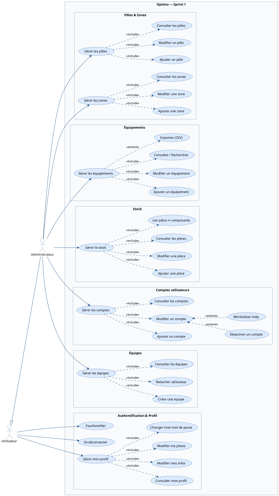
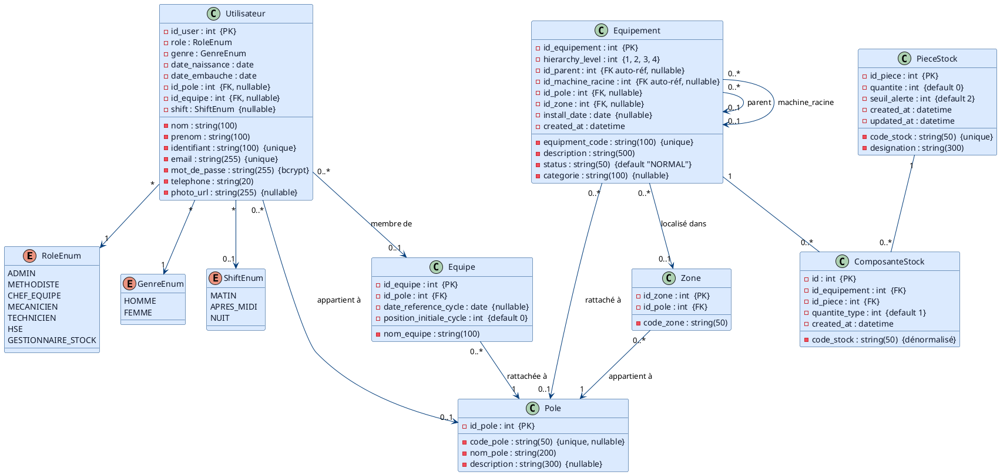

# Sprint 1 — Socle technique et Infrastructure

## Objectif du Sprint

> Mettre en place l'authentification, le profil utilisateur, et permettre à l'administrateur de construire l'infrastructure de l'entreprise (pôles, zones, équipements, stock, comptes utilisateurs).

## Périmètre

| Fonctionnalité | Estimation |
|----------------|------------|
| Système d'authentification (connexion, déconnexion) | 3 pts |
| Gestion des pôles, zones et équipements (hiérarchie L1-L4) | 5 pts |
| Gestion des comptes utilisateurs et privilèges | 5 pts |
| Catalogue et stock des pièces de rechange | 3 pts |
| Gestion du profil et changement de mot de passe | 2 pts |
| **Total** | **18 pts** |

---

## 1. Diagramme de cas d'utilisation

---

## 2. Diagramme de classes

> Basé sur les **vraies tables** de la base de données.
> Tables : `utilisateurs`, `poles`, `zones`, `equipes`, `equipements`, `pieces_stock`, `composante_stock`.

---

## 3. Diagrammes de séquence

Les diagrammes de séquence pour les cas d'utilisation principaux ("S'authentifier", "Créer un compte utilisateur") seront détaillés dans le **fichier final dédié** (`06-diagrammes-sequence.md`) après validation des 4 diagrammes de classes et cas d'utilisation des sprints.
