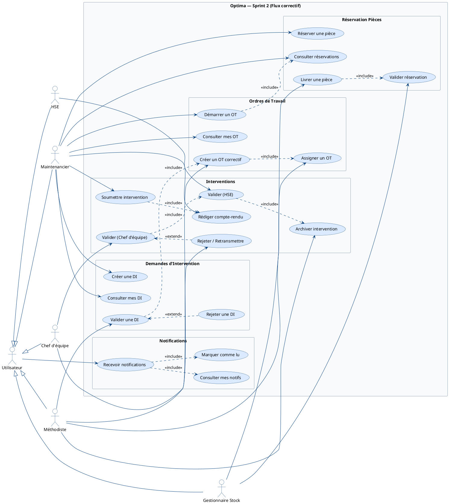
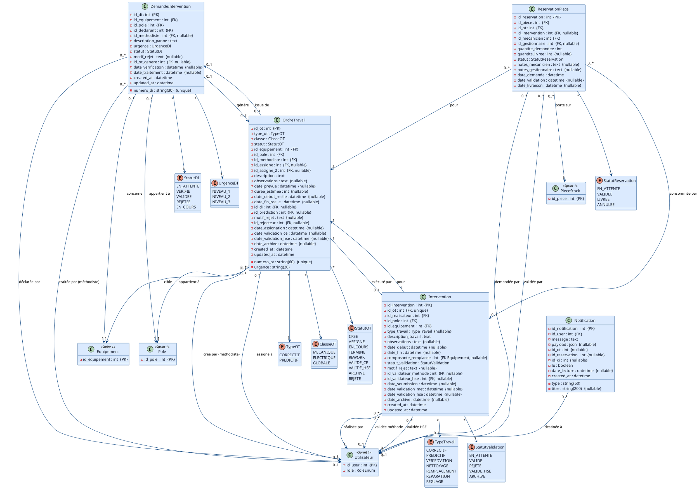

# Sprint 2 — Flux Correctif Complet

## Objectif du Sprint

> Implémenter le flux complet de maintenance corrective, de la déclaration de panne par le maintenancier jusqu'à l'archivage de l'intervention par le méthodiste, en passant par la création de l'OT, la réservation des pièces et la validation en cascade (chef d'équipe → HSE).

## Périmètre

| Fonctionnalité | Estimation |
|----------------|------------|
| Création et suivi des Demandes d'Intervention (DI) | 5 pts |
| Création et assignation des OT correctifs | 8 pts |
| Réservation et délivrance des pièces | 5 pts |
| Saisie et validation du rapport d'intervention | 5 pts |
| Validation et archivage des interventions | 6 pts |
| Notifications temps réel (DI/OT/stock) | 5 pts |
| **Total** | **34 pts** |

---

## 1. Diagramme de cas d'utilisation

---

## 2. Diagramme de classes

> Basé sur les **vraies tables** : `demandes_intervention`, `ordres_travail`, `interventions`, `reservations_pieces`, `notifications`.
> Les classes héritées du Sprint 1 (Utilisateur, Equipement, Pole, PieceStock) sont représentées en allégé pour la lisibilité.

---

## 3. Diagrammes de séquence

Les diagrammes de séquence pour les cas d'utilisation principaux (création + validation d'une DI, cycle complet d'intervention avec validations cascade) seront détaillés dans le **fichier final dédié** (`06-diagrammes-sequence.md`).
