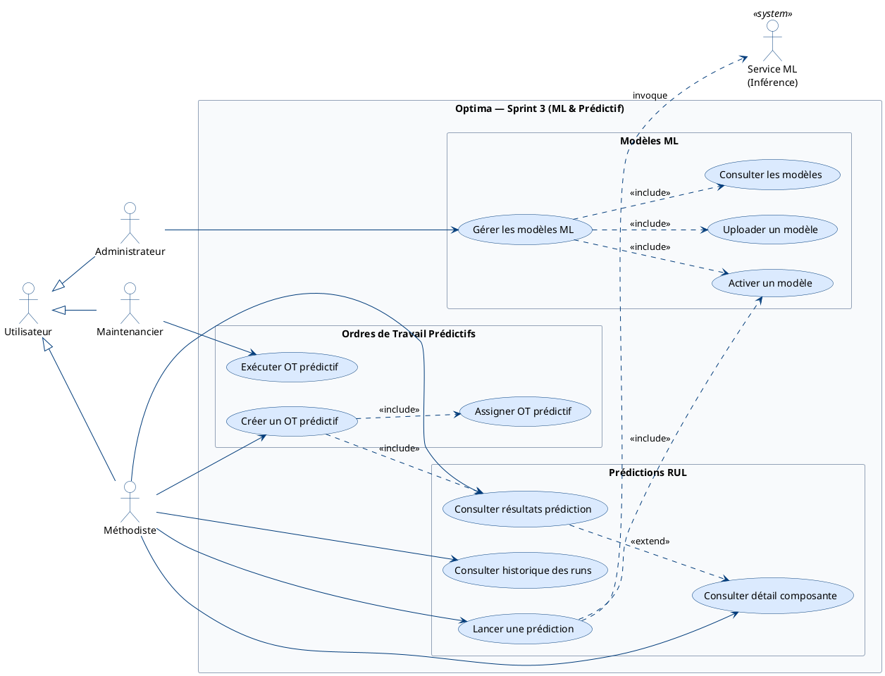
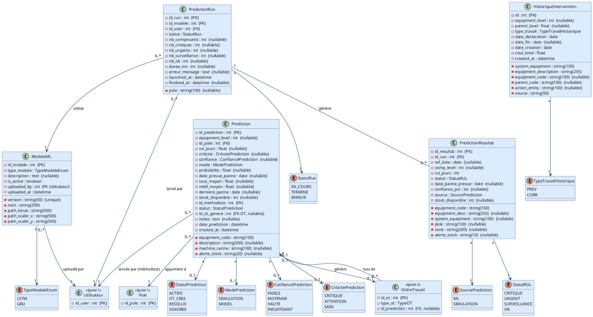

# Sprint 3 — Module ML & Ordres de Travail Prédictifs

## Objectif du Sprint

> Intégrer les modèles d'intelligence artificielle (LSTM/GRU) pour prédire la durée de vie restante (RUL) des composantes critiques, et permettre au méthodiste de transformer une prédiction critique en ordre de travail prédictif (proactif).

## Périmètre

| Fonctionnalité | Estimation |
|----------------|------------|
| Gestion des modèles ML (upload et activation) | 5 pts |
| Lancement d'une prédiction sur composantes L3-L4 | 5 pts |
| Consultation des résultats de prédiction et création d'un OT prédictif | 5 pts |
| **Total** | **15 pts** |

---

## 1. Diagramme de cas d'utilisation

---

## 2. Diagramme de classes

> Basé sur les **vraies tables** : `modeles_ml`, `predictions`, `prediction_runs`, `prediction_resultats`, `historique_interventions`.

---

## 3. Diagrammes de séquence

Les diagrammes de séquence pour les cas d'utilisation principaux ("Lancer une prédiction RUL", "Uploader et activer un modèle ML") seront détaillés dans le **fichier final dédié** (`06-diagrammes-sequence.md`).
