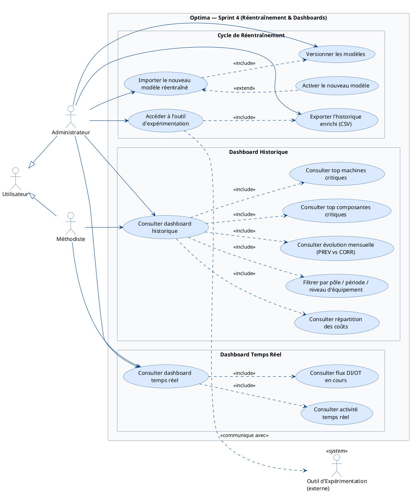
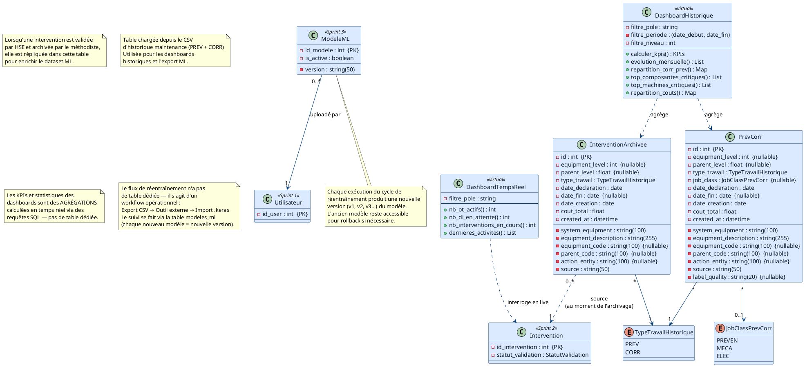

# Sprint 4 — Réentraînement & Dashboards

## Objectif du Sprint

> Boucler le cycle d'amélioration continue du modèle ML grâce à l'intégration d'un outil de réentraînement externe, et fournir aux administrateurs/méthodistes des tableaux de bord d'analyse historique et de suivi temps réel des KPIs de maintenance.

## Périmètre

| Fonctionnalité | Estimation |
|----------------|------------|
| Réentraînement de modèle (export historique + outil externe) | 5 pts |
| Import et activation du nouveau modèle réentraîné | 5 pts |
| Tableau de bord KPIs et historique des interventions | 8 pts |
| **Total** | **18 pts** |

---

## 1. Diagramme de cas d'utilisation

---

## 2. Diagramme de classes

> Sprint 4 introduit la table `interventions_archivees` (archive miroir pour ML et dashboards) et la table `prev_corr` (données historiques 2 ans pour dashboards). Le sprint réutilise aussi les classes `ModeleML` du Sprint 3 (versioning des modèles réentraînés).

---

## 3. Diagrammes de séquence

Les diagrammes de séquence pour les cas d'utilisation principaux ("Cycle complet de réentraînement", "Consulter dashboard historique avec filtres") seront détaillés dans le **fichier final dédié** (`06-diagrammes-sequence.md`).
